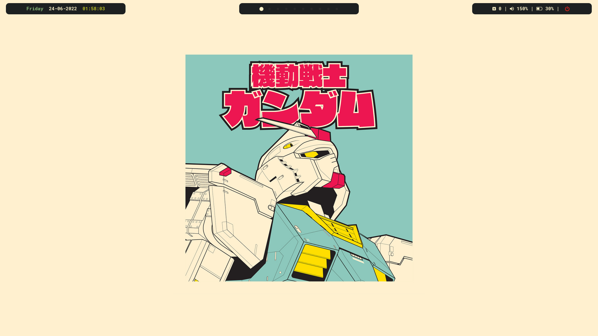
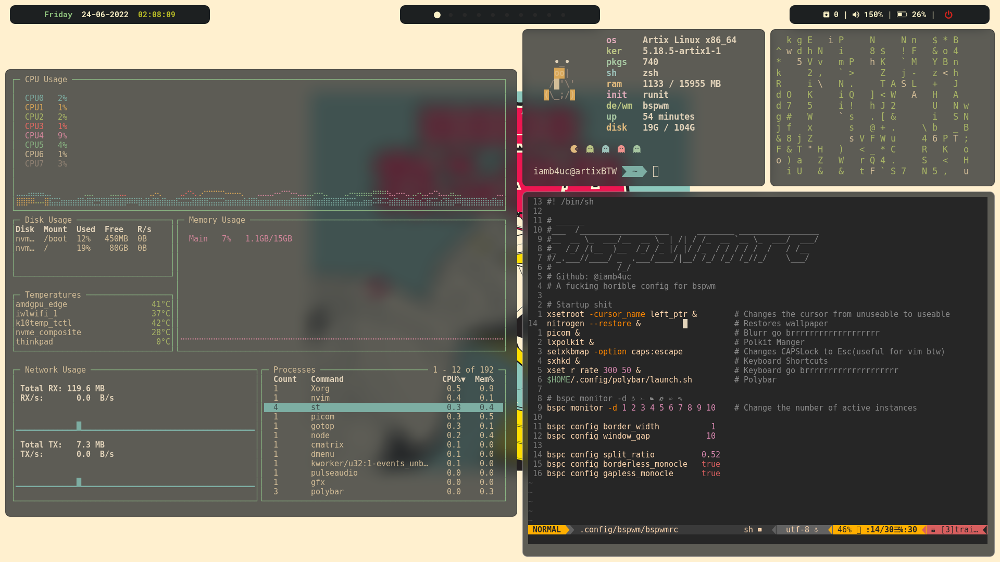
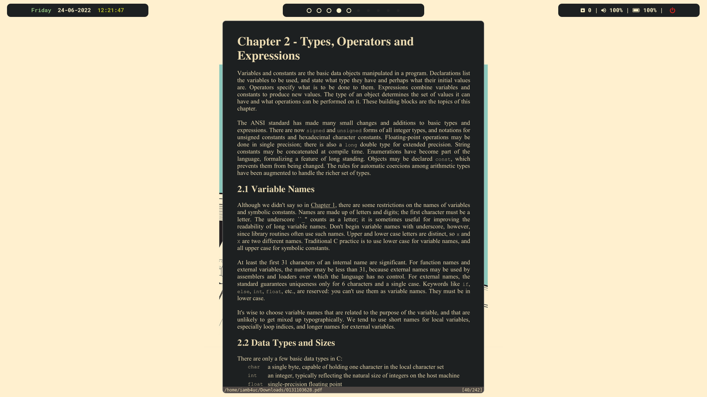

# BSPWM-Rice

New Parition new distro and new window manager

## Screenshots

### Details
***OS***: Artix  
***WM***: bspwm  
***TERMINAL***: st  
***Bar***: polybar  
***Compositor***: picom(jonaburg)
***Font***: RobotoMono Nerd Font  
***Edittor***: Neovim  
***Document Viewer***: Zathura  
***Others***: sxhkd, feh, ranger, spicetify(*custom css*)  

### About
This is one of my rice of bspwm, more on the way, also you can see [glorious dots](https://github.com/iamb4uc/glorious-dots) for all of my other dots and shit like that.
